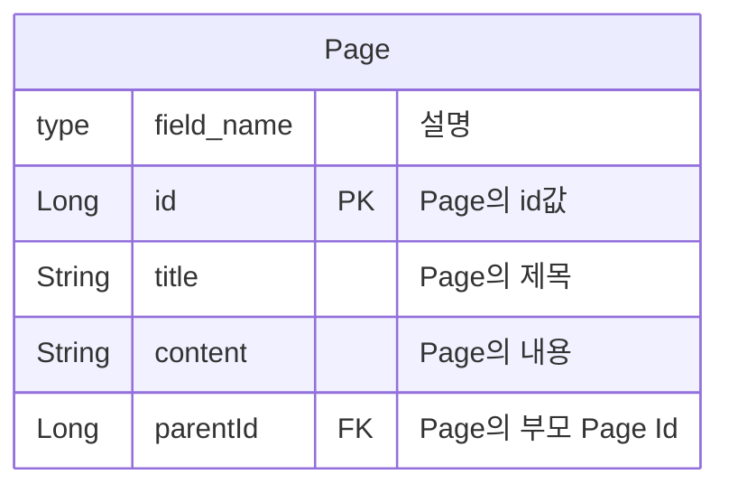
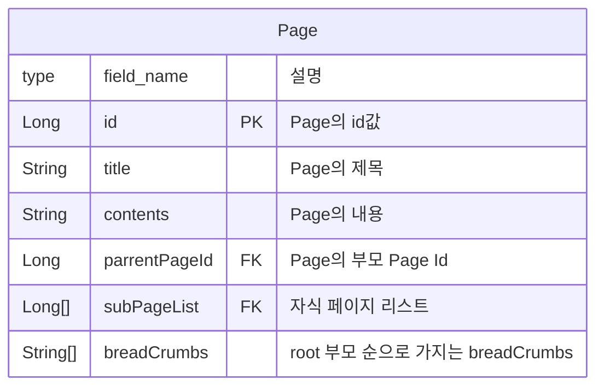
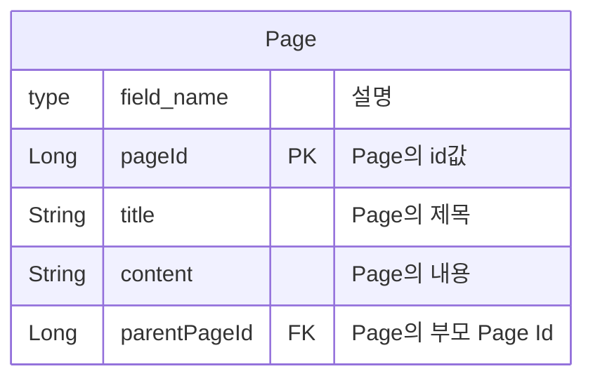

# page
원티드프리온보딩 BE-8팀 - PageApi 과제
## 개요

 Page 과제 구현 과제를 개인 별로 구현 후 회의를 통해 하나의 과제로 통합하였다.
가장 중요한 것은 자식 Page 가져오기와 breadCrumbs 도출하기가 명확한 목표였다.

## **[depth = n , repo 기준 시간 복잡도 구성]**

- 자식 page 가져오기 : O(1)
- breadCrumbs 도출하기
    - [정진성] 알고리즘 O(n) - Application 내부에서 재귀 호출
    - [이건호] 알고리즘 O(재귀) + O(1) ids를 가지고 page들을 다시 조회
    - [박상민]  알고리즘 O(재귀) + reverse 1회 시간복잡도 발생.
    - [최영준] 시간 복잡도 O(1)  - 페이지 생성시 breadCrumbs 같이 저장하는 방식
    
    조회만 구현하는 해당 방식에서는 조회 호출시 부모 페이지를 찾아 반환하는 방식으로 제출 
    

### 테이블 구조



### 결과정보

```java
{
	"id": 6,
    "title": "서브 1-1-1",
    "content": "서브 1-1-1",
    "parentId": 4,
    "subPages": [ 6, 7 ],
    "breadcrumbs": [ "메인", "서브 1", "서브 1-1" ]
}
```

### 결론

---

최대 depth라는 제약사항이 없는 상황에서,

1) 쿼리의 시간

2) DB 접근 횟수

3) 삭제, 수정, 삽입에 대한 자유도

4) 공간 복잡도

위의 4개를 고려한 결과 page entity에서 id와 parent_id만 재귀쿼리를 통해 도출해내는 것이 가장 효율적인 방법이다.

---

# 개인별 구현 요약

## 영준

---

### 구조 ( erd )

---



### 자식 page 가져오기

---

자식의 개수 = n이라고 했을 때, 

Query : Select * from page where id = ?;
따라서  n번의 쿼리를 통해 가져올 수 있다.

→ select * from page where parrent_id = ?;

쿼리를 변경하여 1번의 쿼리를 통해 가져올 수 있게 최적화 할 수 있다.

### breadCrumbs 도출하기

---

subPage를 생성 시 parentPage의 breadCrumbs를 읽어 String List에 추가하고, 마지막으로 자기 자신을 추가해 놓은 상태로 저장한다.

따라서 Read 속도는 O(1)이다.

### 장점

---

breadCrumbs 구하는 시간이 빠르다.

### 문제점

---

중간 page의 title이 수정되거나 삭제된다면,
그 아래의 모든 자식들의 breadCrumbs를 수정해야하는 단점이 생긴다.
이렇게 구현하려면 삽입, 수정, 삭제가 자유롭지 못한 구조에 적용해야한다.

그런 제약사항이 없었기 때문에 이 구조를 채택할 수는 없었다.

## 진성

---

### 구조 ( erd )

---


### 자식 page 가져오기

---

Query : Select * from page where parent_id = ?;
따라서 O(1)의 시간을 통해 가져올 수 있다.

### breadCrumbs 도출하기

---

```java
Query: SELECT * FROM page WHERE id = ?;
```

어플리케이션 내부에서 해당 Query를 부모 parent id 값이 null일때까지 반복하여 호출한다.

depth n일 경우 O(n)의 시간이 소요된다.

 

### 장점

---

구조가 변경, 삭제, 삽입 되더라도 Page 조회 시마다 다시 불러오기 때문에 변경 대응에 용이하다.

### 문제점

---

BreadCrumbs의 호출 시간 복잡도가 O(n)으로 조회가 비교적 더 소요된다.

또한 부모 페이지를 찾는 과정에서 매 페이지마다 DB 호출을 통해 비용을 많이 소모한다. 

## 상민

---

### 구조 ( erd )

---



### 자식 page 가져오기

---

Query : Select * from page where parent_id = ?;
따라서 O(1)의 시간을 통해 가져올 수 있다.

### breadCrumbs 도출하기

---

```java
String sql = """
                WITH CHILD(PAGE_ID, TITLE, CONTENT, PARENT_PAGE_ID) AS (
                  SELECT PAGE_ID, TITLE, CONTENT, PARENT_PAGE_ID
                  FROM PAGE
                  WHERE PAGE_ID = ?
                  UNION ALL
                  SELECT P.PAGE_ID, P.TITLE, P.CONTENT, P.PARENT_PAGE_ID
                  FROM CHILD C
                  INNER JOIN PAGE P ON C.PARENT_PAGE_ID = P.PAGE_ID
                )
                SELECT *
                FROM CHILD
                OFFSET 1 ROWS; -- 첫 번째 행 제외
                """;
```

데이터베이스 내에서 부모 페이지를 재귀적으로 호출하여 저장 하여 리스트에 저장 한다.
해당 리스트를 역순으로 정렬하여 리스트를 반환한다.

### 단순 재귀 쿼리 테스트 ( 10000개의 데이터 10000개의 depth)


### 장점

---

BreadCrumbs 호출 과정을 데이베이스 내부에서 재귀적으로 호출하여 부모 페이지들을 찾음으로써 DB 호출 비용을 줄일 수 있다.

### 문제점

---

재귀적 호출시에 Page Entity의 모든 내용 포함하여 조회함으로써,

depth가 깊어질수록 메모리에 더 많은 양의 데이터가 존재하게 되는데 이는 memory의 부족현상이 발생할 수 있다.

## 건호

---

### 구조 ( erd )

---


### 자식 page 가져오기

---

Query : Select * from page where parent_id = ?;
따라서 O(1)의 시간을 통해 가져올 수 있다.

### breadCrumbs 도출하기

---

```java
/* 부모 page를 찾는 재귀 sql*/
String sql  = """
            WITH RECURSIVE child_page(id, parent_id) AS (
              SELECT id, parent_id FROM page
              WHERE id = :id
              UNION ALL
              SELECT page.id, page.parent_id FROM page
              JOIN child_page ON page.id = child_page.parent_id
            )
            SELECT * FROM child_page;
            """;
```

```java
/* 부모페이지의 id리스트로 한번에 모든 부모페이지 조회하는 방법 */
String sql = "SELECT id, title, content, parent_id FROM page WHERE id IN (:ids)";
```

데이터베이스 내에서 부모 페이지를 재귀적 으로 호출하여 저장 후 부모 페이지가 있는지 확인한다.

이후 Application 내부에서 반복문을 통해 부모 페이지를 호출한 역순 으로 리스트에 저장한다.

### 단순 재귀 쿼리 테스트 ( 10000개의 데이터 10000개의 depth)


물론 이후에 10000개의 ids를 가지고 조회하는 시간은 추가 되겠지만, 재귀 쿼리의 기준으로는 상민님 방식보다 훨씬 빠르다.

### 장점

---

BreadCrumbs 호출 과정을 데이베이스 내부에서 재귀적으로 호출하여 부모 페이지들을 찾음으로써 DB 호출 비용을 줄일 수 있다.

Page객체의 id와 parent_id만 조회하기때문에 상민님의 방법에 비해 메모리 효율이 늘어난다는 장점이 있고, Page객체의 컬럼이 추가 되더라도 추가적인 메모리 누수가 적다.
